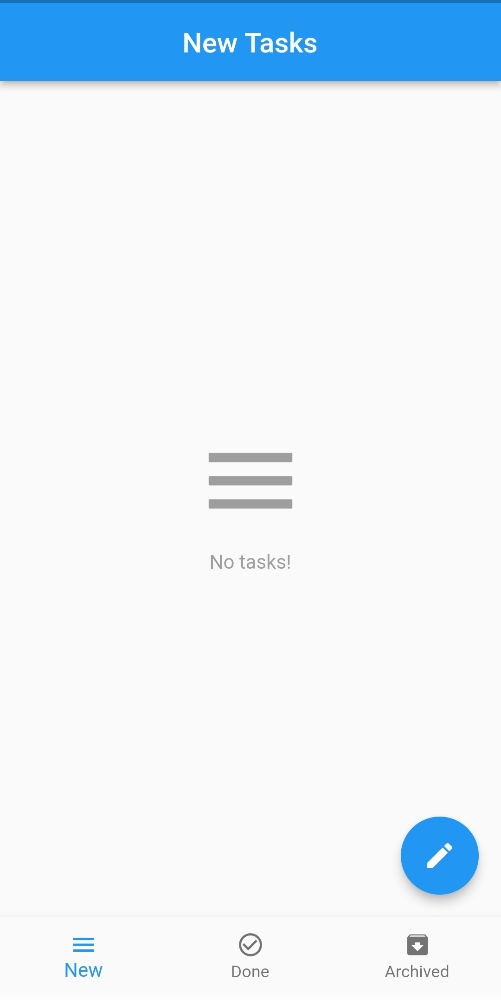
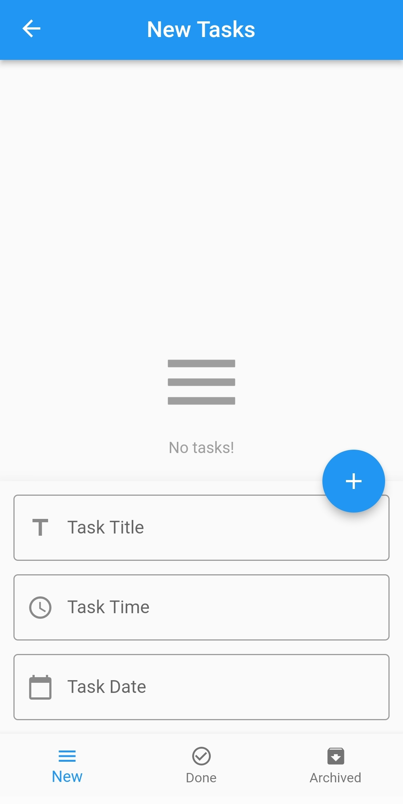
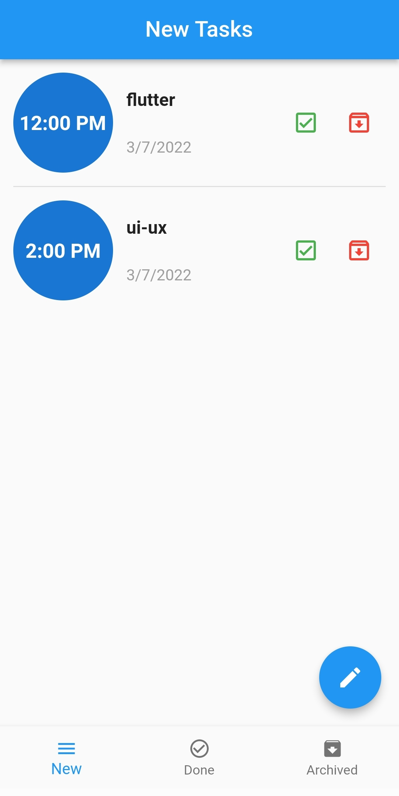
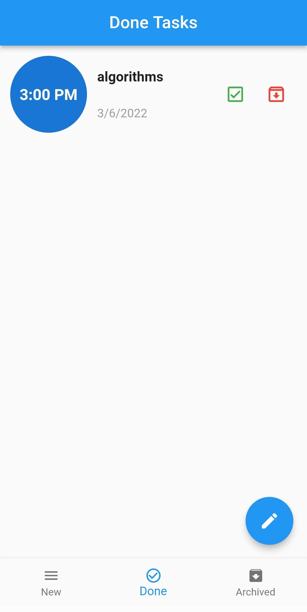
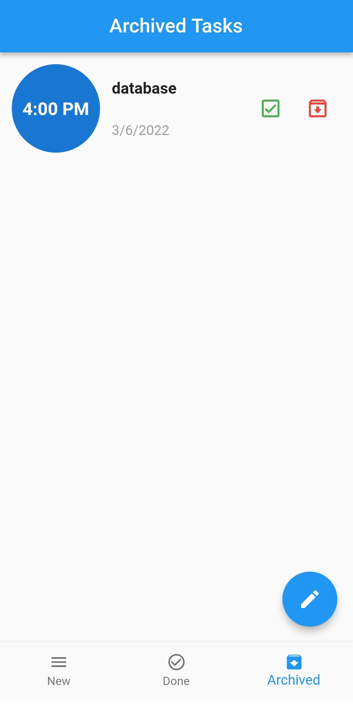

# Todo App
## Built to add tasks by using local database "sqf-lite".

<text> ----------------------------------------------------------------------------------------------------------------------------- </text>

  
### Three screens New, Done and Archived tasks 
  
### You can delete tasks by swaping it to left or right

